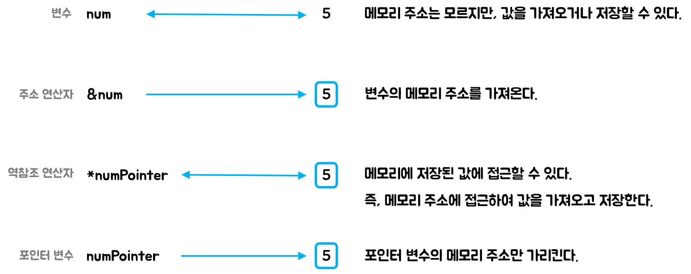

# 포인터

변수는 컴퓨터의 메모리에 생성.

즉, 메모리에 일정한 공간을 확보해두고 원하는 값을 저장하거나 가져오는 방식.

변수는 변수명 사용하지만 메모리의 특정 장소에 있으므로 메모리 주소로도 표현할 수 있다.


```c
#include <stdio.h>

int main() {
    int num = 7;
    
    printf("%d\n", num); // 7
    printf("%p\n", &num); // 0x7fff3ccef6c4 : 메모리주소, 실행때마다 달라짐
    
    return 0;
}
```


포인터 변수는 `*`를 사용하여 선언

> **포인터 변수(포인터)**
>
> - 자료형 *포인터이름;
> - 포인터 = &변수;

포인터와 메모리 주소는 같은 의미이다.

> int *변수명
>
> : pointer to int라고 읽음.
>
>  int형 공간을 가리키는 포인터라는 뜻


## 역참조(dereference)

포인터 변수에는 메모리 주소가 저장되어 있다. 이때 메모리 주소가 있는 곳으로 이동해서 값을 가져오고 싶다면 역참조(dereference) 연산자 `*`를 사용한다.

```c
#include <stdio.h>

int main() {
    int *numPoint;
    int num = 5;
    
    numPoint = &num;
    
    printf("%d\n", *numPoint);
    
    return 0;
}
```


그렇다면 역참조를 이용해서 해당 역참조에 값을 할당하면 어떻게 될까?

```c
#include <stdio.h>

int main() {
    int *numPoint;
    int num = 5;
    
    numPoint = &num;
    
    *numPoint = 8;
    
    printf("%d\n", *numPoint); // 8
    printf("%d\n", num); // 8
    
    return 0;
}
```

메모리주소에 들어간 값이 바뀌었기에 메모리주소를 통해 값을 찾아가면 동일하게 바뀌어진 값이 나오게 된다.


**메모리 변수와 일반 변수의 Type이 다르다.**

```c
#include <stdio.h>

int main() {
    int *numPoint;
    int num = 5;
    
    numPoint = num;
    
    return 0;
}
```

위의 결과는 아래와 같다.

```bash
Main.c: In function ‘main’:
Main.c:7:14: warning: assignment to ‘int *’ from ‘int’ makes pointer from integer without a cast [-Wint-conversion]
    7 |     numPoint = num;
      |              ^
Main.c:4:10: warning: variable ‘numPoint’ set but not used [-Wunused-but-set-variable]
    4 |     int *numPoint;
      |          ^~~~~~~~
```

포인터형 변수에 일반 타입을 바로 할당할 수 없다.





## void 포인터 선언학

void 포인터는 자료형이 정해지지 않았으므로 값을 가져오거나 저장할 크기도 정해지지 않았다.

따라서, **void 포인터는 역참조할 수 없다.**


## 이중 포인터

```c
#include <stdio.h>

int main() {
    int *numPoint;
    int **numPoint2;
    int num = 5;
    
    numPoint = &num;
    numPoint2 = &numPoint;
    printf("%d\n", **numPoint2); // 5
    
    return 0;
}
```

포인터도 실제로는 변수이기 때문에 메모리 주소를 구할 수 있다. 하지만, 포인터의 메모리 주소는 일반 포인터에 저장할수 없고, 이중 포인터에 저장해야 한다. (`pointer to pointer to int`)

포인터를 선언할 때 `*`의 개수에 따라서 삼중, 사중 그 이상도 만들 수 있다.