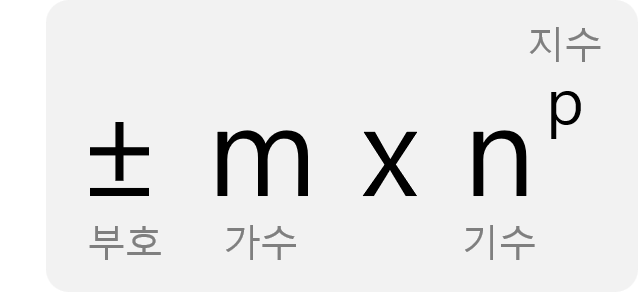

# 변수

- 변수 여러개를 한 번에 선언하는 방법

```c
int num1, num2, num3;
```


## 자료형

### 정수 자료형

| 자료형                | 크기    | 범위                                       |
| ------------------ | ----- | ---------------------------------------- |
| char               | 1byte | -128~127                                 |
| unsigned char      | 1byte | 0~255                                    |
| short              | 2byte | -32,768~32,767                           |
| unsigned short     | 2byte | 0~65,535                                 |
| int                | 4byte | -2,147,483,648~2,147,483,647             |
| unsigned int       | 4byte | 0~4,294,967,295                          |
| long               | 4byte | -2,147,483,648~2,147,483,647             |
| unsigned long      | 4byte | 0~4,294,967,295                          |
| long long          | 8byte | -9,223,372,036,854,775,808<br />~9,223,372,036,854,775,807 |
| unsigned long long | 8byte | 0~18,446,744,073,709,551,615             |

:warning: long은 운영체제와 플랫폼마다 크기가 다름

| 운영체제    | CPU(플랫폼)   | 바이트 크기 |
| ------- | ---------- | ------ |
| Windows | 32bit(x86) | 4      |
|         | 64bit      | 4      |
| Linux   | 32bit      | 4      |
|         | 64bit      | 8      |
| OS X    | 32bit      | 4      |
|         | 64bit      | 8      |


#### 자료형 크기 구하기

- sizeof 표현식
- sizeof(자료형)
- sizeof(표현식)

```c
// sizeof(자료형)
int size;
size = sizeof(int);

// sizeof(표현식)
int num = 3;
int size = sizeof(num);
```


#### 최솟값과 최댓값

`limits.h` 헤더 파일을 사용해야 합니다.

| 자료형                | 최솟값       | 최댓값        |
| ------------------ | --------- | ---------- |
| char               | CHAR_MIN  | CHAR_MAX   |
| short              | SHRT_MIN  | SHRT_MAX   |
| int                | INT_MIN   | INT_MAX    |
| long               | LONG_MIN  | LONG_MAX   |
| long long          | LLONG_MIN | LLONG_MAX  |
| unsigned char      | 0         | UCHAR_MAX  |
| unsigned short     | 0         | USHRT_MAX  |
| unsigned int       | 0         | UINT_MAX   |
| unsigned long      | 0         | ULONG_MAX  |
| unsigned long long | 0         | ULLONG_MAX |


운영체제가 발전하면서 정수 자료형의 크기도 달라짐에 따라 정수 자료형 이름은 많은 혼란을 가져왔다.

C99 표준부터는 `stdint.h` 헤더 파일이 추가되었다.

자료형 이름에 비트 단위로 크기가 표시되었다.

```c
int8_t num = 8;
uint32_t unum = 13;
```

최소, 최대값은 stdint.h 헤더 파일에 있으므로, limits.h 헤더 파일을 사용하지 않아도 된다.


### 실수 자료형

| 자료형         | 크기    | 범위                                | 유효자릿수 | 비고                  |
| ----------- | ----- | --------------------------------- | ----- | ------------------- |
| float       | 4byte | 1.175494e-38<br />~3.402823e+38   | 7     | IEEE 754 단정밀도 부동소수점 |
| double      | 8byte | 2.225074e-308<br />~1.797693e+308 | 16    | IEEE 754 배정밀도 부동소수점 |
| long double | 8byte | 2.225074e-308<br />~1.797693e+308 | 16    | IEEE 754 배정밀도 부동소수점 |

:warning: long double은 운영체제와 플랫폼마다 크기가 다름

| 운영체제    | CPU(플랫폼) | 바이트 크기 |
| ------- | -------- | ------ |
| Windows | 32bit    | 8      |
|         | 64bit    | 8      |
| Linux   | 32bit    | 12     |
|         | 64bit    | 16     |
| OS X    | 32bit    | 16     |
|         | 64bit    | 16     |

#### 부동소수점



| 자료형    | 크기    | 부호   | 지수    | 가수    |
| ------ | ----- | ---- | ----- | ----- |
| float  | 32bit | 1bit | 8bit  | 23bit |
| double | 64bit | 1bit | 11bit | 52bit |

단정밀도와 배정밀도 부동소수점은 저장할 수 있는 크기가 다르므로 유효자릿수의 차이가 있다.

배정밀도 부동소수점이 더 정밀하게 표현할 수 있다.


### 최솟값과 최댓값

`#include <float.h>`

- FLT_MIN / FLT_MAX
- DBL_MIN / DBL_MAX
- LDBL_MIN / LDBL_MAX


### 숫자 서식 지정자

`printf`로 정수나 실수를 출력할 때, 다음과 같은 서식 지정자 사용

| 서식 지정자 | 설명                             |
| ------ | ------------------------------ |
| %d     | 부호 있는 정수                       |
| %ld    | 부호 있는 long 정수                  |
| %lld   | 부호 있는 long long 정수             |
| %u     | 부호 없는 정수                       |
| %lu    | 부호 없는 long 정수                  |
| %llu   | 부호 없는 long long 정수             |
| %f     | float, double형 실수              |
| %Lf    | long double형 실수                |
| %e     | float, double형 실수를 지수 표기법으로 출력 |
| %Le    | long double형 실수를 지수 표기법으로 출력   |


:man_teacher:int_least32_t, int fast32_t 이러한 것도 stdint.h에 정의되어 있는데 무슨 의미일까?

- least: 최소 몇 비트만 만족하면 된다는 뜻

  > 예를 들어, int_least32_t는 최소 4byte를 만족하면 되고 플랫폼의 특성에 따라 32bit보다 크게 정의되어 있을 수도 있다.

- fast: 최소 몇 비트를 만족하면서 CPU에서 가장 빠른 성능을 내는 자료형으로 정의

  > int_fast16_t는 최소 16bit이지만 Visual Studio 2015에서는 32bit 크기의 int로 정의되어 있다. 즉, CPU의 특성에 따라 자료형이 정의되며 최소 크기보다 클 수도 있다.


:woman_teacher:숫자 앞자리를 0으로 채우려면 어떻게 해야 할까?

```c
int number = 328;
printf("%05d\n", number);
```


### 문자 자료형

| 자료형           | 크기    | 범위       | 비고            |
| ------------- | ----- | -------- | ------------- |
| char          | 1byte | -128~127 | 문자 저장         |
| unsigned char | 1byte | 0~255    | 바이트 단위 데이터 저장 |

| 10진수 | 16진수 | 문자   | 표기법  | 설명                                       |
| ---- | ---- | ---- | ---- | ---------------------------------------- |
| 10   | 0x0A | LF   | \n   | 개행, 라인 피드(Line Feed), 새 줄(new line), 줄바꿈 |
| 13   | 0x0D | CR   | \r   | 복귀, 캐리지 리턴(Carriage Return), 줄의 끝에서 시작 위치로 되돌아감 |
| 9    | 0x09 | TAB  | \t   | 수평 탭(horizontal tab)                     |

> **CR, LF 유래**
>
> CR, LF는 타자기에서 나온 용어로서, 타자기에서 줄바꿈을 하려면 종이를 오른쪽으로 쭉 밀고, 다시 종이를 한 줄 만큼 위로 올린다.
>
> 종이를 오른쪽으로 밀어서 처음으로 오게 하는 행동을 복귀(Carriage Return)라고 하고, 종이를 위로 올리는 행동을 개행(Line Feed)이라고 한다.
>
> - Windows: CR LF
> - 유닉스, 리눅스, OS X: LF
> - Mac OS 9(클래식): CR